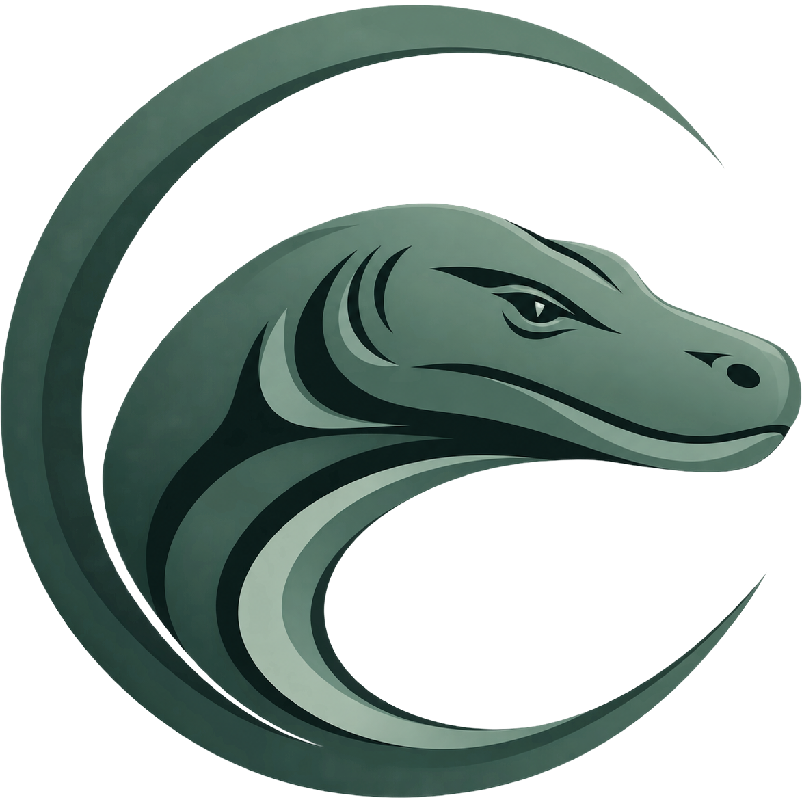

# Komodo

Komodo is a self-hosted system for building, deploying, and automating software across multiple servers.

> [!NOTE]
> This repository is a hard fork of [Komodo](https://github.com/moghtech/komodo), initially created to add a File Manager and now maintained to deliver additional features.
> Version 3.0.0 and later has diverged from upstream. Upstream migrations are not supported, and backward compatibility should not be assumed. Selected upstream fixes may still be cherry-picked.

## Quick Start

Follow the [Quick Start](https://komodo.docs.neureka.dev/quick-start) to start MongoDB, Core, and Periphery with Docker Compose, then deploy your first Stack.

Official Komodo releases are distributed as container images. Advanced users may compile the source themselves, but native binary deployments are not an officially supported installation path.

## Usage

The recommended Compose project runs Core, MongoDB, and Periphery for the local Docker host. Add standalone Periphery containers only on other servers you want to manage.

- Read the [documentation](https://komodo.docs.neureka.dev/).
- Use the [CLI](https://komodo.docs.neureka.dev/reference/cli) and [API clients](https://komodo.docs.neureka.dev/reference/api-and-client-libraries) for automation.

## Features

- Deploy, inspect, and operate Docker containers and Compose stacks.
- Build container images from Dockerfiles or Git repositories.
- Automate multi-step workflows with procedures, actions, schedules, and webhooks.
- Monitor server health, resource usage, container logs, and application activity.
- Manage multiple servers, users, permissions, secrets, and resource configuration from one interface.

## Components

| Component | Purpose |
| --- | --- |
| Core | Hosts the browser interface and API, stores configuration, and coordinates operations. |
| Periphery | Runs on connected servers to execute actions and report system and container state. |
| CLI | Provides terminal access to Komodo resources and automation. |

## Why Use Komodo?

Komodo brings deployment, builds, observability, and automation into one self-hosted interface. It scales from one Docker host to a fleet of servers while keeping infrastructure control in your environment.
